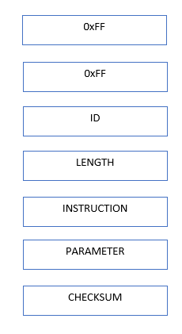
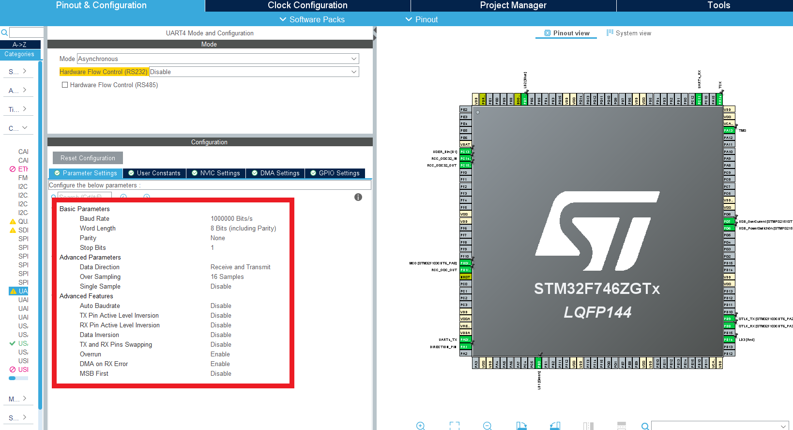
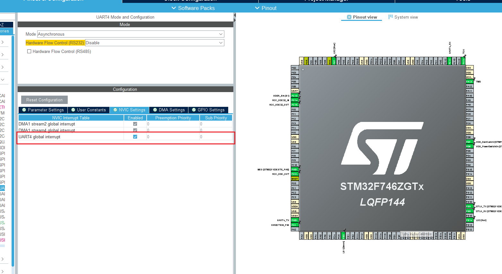
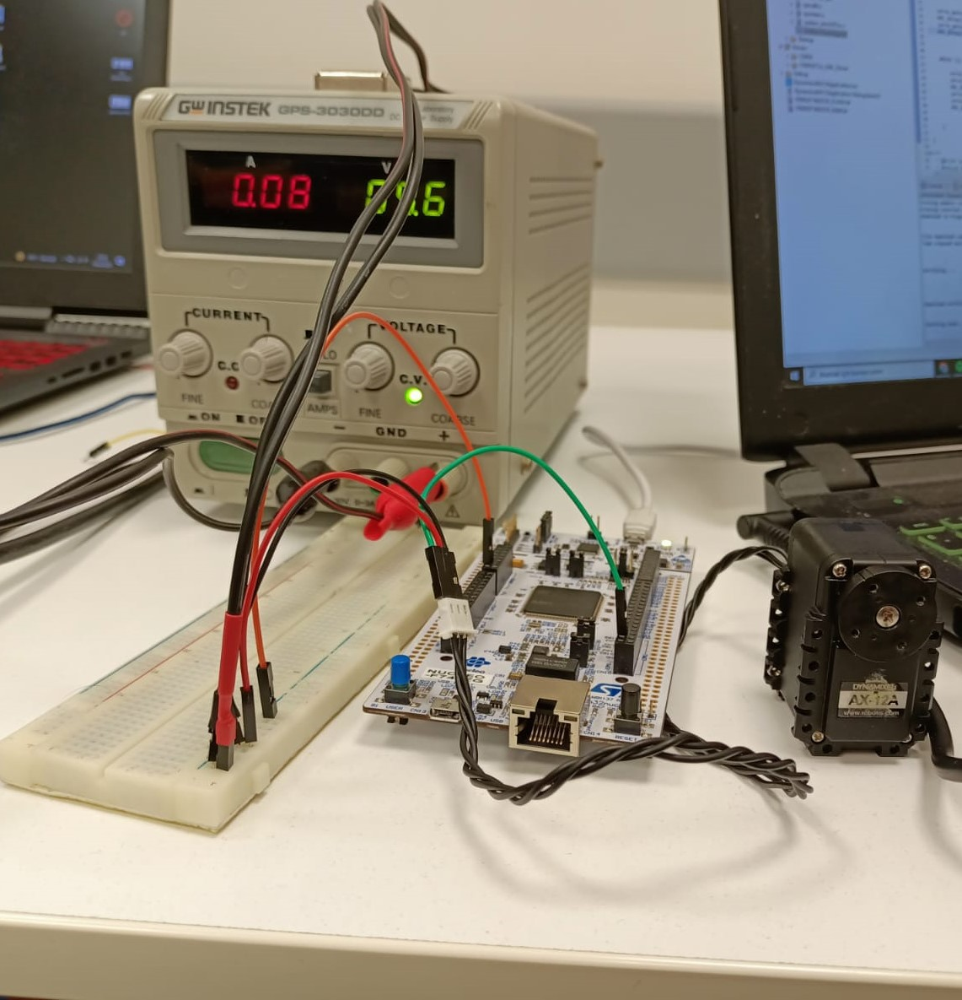

## Dynamixel AX-12A Servo Motor  | STM32 Nucleo Application Series ##

In this project, Dynamixel AX12-A Servo motors are driven by serial communication over UART line.

The DATA line of the servo motor is used only as RX line. Therefore, no data was received from the dynamixel servo motor.

Do not forget to set the servo motor ID and baudrate correctly in your application. 

The datasheet of the dynamixel is given in the ***/dynamixel/*** folder.

**Dynamixel AX12-A Communation Protocol**

The general structure of the instruction package is as shown below:

  

***0xFF,0xFF:*** starting bytes.

***ID:*** Unique ID of a dynamixel motor.

***Length:*** The length of the packet. "Number of parameters(N)+2".

***Instruction:***  insturction for the dynamixel actuator to perform.
  
***Parameter:***  packet parameter
  

***Checksum Value:*** is 8 bit unsigned integer. For checksum calculation:

Checksum = ~(ID + Length + Instruction + Parameter1 + .... + ParameterN)

***Electronical Connection***

***GND:*** Common ground.

***VDD:*** 9.6V.

***DATA:*** Nucleo UART4 Tx line(PA0).

***STM Setting***

On the STM side, sending data with interrupt via the UART4 port. Baudrate is set to 1000000. The relevant adjustments are shown in the image:

  

  

**Figure of the System**

The general system shown in the image:

  

